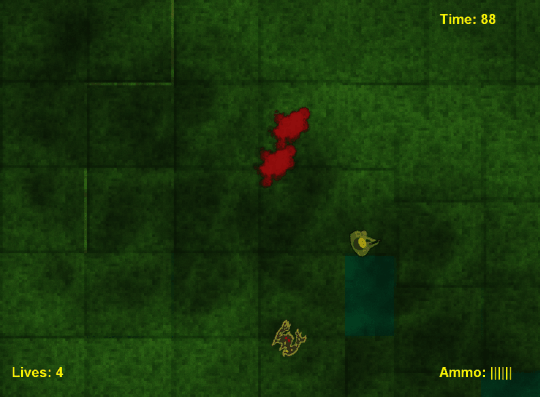

# ruby-game
Survivorama - Work in progress

#Screenshot:

#Controls:
Arrows - movement

Space - shoot

Enter - restart

Esc - Exit

#Setup:
I'm using the Gosu gem
https://www.libgosu.org/

get dependencies 'bundle install'

to run 'bundle exec ruby class/GameWindow.rb'

based on 
https://github.com/gosu/gosu/wiki/Ruby-Tutorial

sounds by:
mdl-03@freesound.org
paulmorek@freesound.org